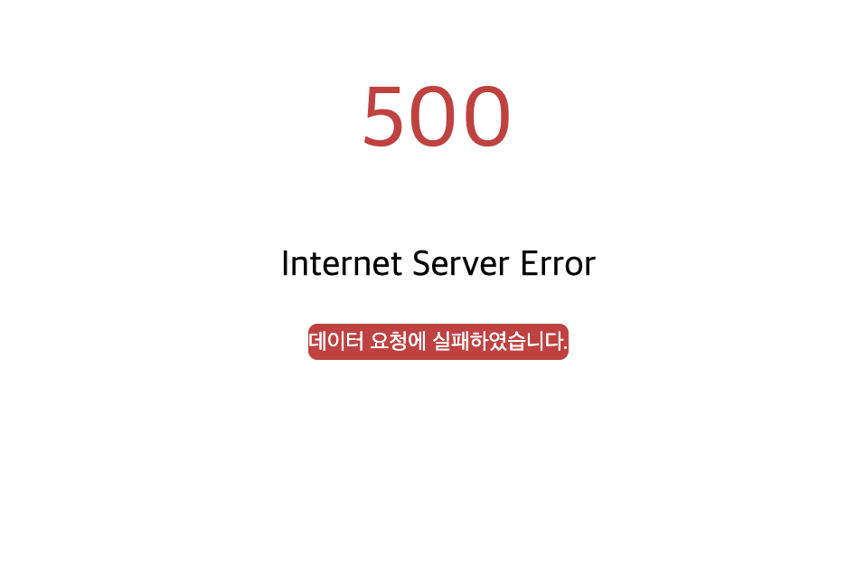

# wantend-TBWA

## 1. 프로젝트 소개

- 주제 : Rakuten File Share Web Application
- 기간 : 22.02.24 ~ 22.02.26

## 2. 배포 링크

https://wanted-rakuten.netlify.app/

## 3. 팀원 소개

<table>

  <tr align="center">
    <td><a href='https://github.com/Jiyong95'>이지용</a></td>
    <td><a href="https://github.com/BByungs">안병진</a></td>
    <td><a href="https://github.com/minjuice1">박민주</a></td>
  </tr>

  <tr align="center">
    <td></td>
    <td></td>
    <td></td>
  </tr>
</table>
</br></br>

## 4. 구현 기능

</br>

### 화면 1: 링크 목록 화면

- ✔ 서버에서 제공한 링크 데이터를 화면
- ✔ 링크 아이템을 클릭하여 상세페이지로 이동
- ✔ 유효기간 유무에 따른 URL 구분
  - 유효기간 이내 : 도메인 주소를 포함한 상세페이지로 이동하는 전체경로를 표시, URL 클립보드에 복사 후 Alert 표시
  - 유효기간 만료 : 만료됨으로 표시, 아무 동작도 하지 않음.
- ✔ 파일 개수의 숫자에 3자리 단위마다 콤마를 표시
- ✔ 파일 사이즈를 읽을 수 있도록 표시
  - ✔ 소수점 둘째 자리까지 표기합니다.
  - ✔ 단위는 숫자 뒤에 B, KB, MB, GB, TB로 표기 (ex. 10.86KB)
- ✔ 유효기간을 아래와 같이 표시하되 실시간으로 반영
  - ✔ 48시간 미만: XX시간 XX분
  - ✔ 48시간 이상: X일
  - ✔ 만료: 만료됨
    </br></br>

### 화면 2: 링크 상세 화면

- ✔ 링크가 가지고 있는 파일 목록을 확인하고 공유
- ✔ 링크 정보를 표시
- ✔ 받기 버튼을 누르면 다운로드 되었습니다.를 내용으로 가지는 브라우저 기본 Alert을 표시
- ✔ 링크의 유효기간이 만료 되지 않았을 경우에만 파일 목록을 표시

</br>

## 5. 추가 구현 기능

- 기준 시간 변경

  - 현재 시간을 기준으로하면 api의 모든 파일의 유효기간이 만료되기 때문에,
    api의 created_at(파일 생성 시간)이 가장 최신의 값을 현재 시간으로 지정하였습니다.

- sessionStorage

  - api Data, 사용자의 접속 시간을 저장
  - sessionStorage에 저장된 Data가 있으면, api 호출을 하지 않는다.

- NotPage
  - 사용자의 잘못된 url 접속 시 보여줄 Page<br />
    </br></br>
- NotData

  - api 호출 문제 시 보여줄 Page<br />
    </br></br>

## 6. 트러블 슈팅

### 1. CORS

- 문제 원인: 자신의 리소스(도메인)에서 다른 리소르를 요청하려면 올바른 CORS 헤더를 포함해야한다.
- 해결 방법: 올바른 CORS헤더를 포함하기 위해 herokuapp 프록시 서버를 이용.

```
"https://cors-anywhere.herokuapp.com/{apiURL}"
```

### 2. [ netlify ] Page Not Found Error

- 문제 정의 : React Router를 사용하는 React 사이트를 netlify에 배포 후 다른 route로 넘어갈 때 Not Found Error 발생.
- 문제 원인 : React Router는 client에서 라우팅을 처리하기 때문에 root가 아닌 페이지(ex: https://testsite/netlify.com/test)에 접속할 때, netlify(server)는 route를 처리하는 방법을 알 수 없어서 에러 발생.
- 해결 방법 : netlify는 client 측에서 처리되지 않는 URL을 처리할 수 있도록 redirects 파일을 제공하므로, 디렉토리 내 netlify.toml 파일 안에

```
`[[redirects]] from = "/*" to = "/index.html" status = 200` 코드 추가하여 해결.
```

</br></br>

## 7. 기술 스택


</br></br>

## 8. 디렉토리 구조

```bash
.
├── App.tsx               # Api Data 호출 ,
├── index.tsx
├── components
├── pages
│   ├── DetailPage         # 상세 페이지
│   ├── ErrorPage
│   │   ├── NotData.tsx    # 500 page
│   │   └── NotPage.tsx    # 404 page
│   └── LinkPage           # 메인 페이지
├── styles
├── types
└── utils
    ├── apiData.ts          # api data handling 함수
    ├── clipboard.ts        # url 클립보드 복사 함수
    ├── formatData.ts       # 파일 용량 변환 함수 , 날짜 변환 함수
    └── sessionStorage.ts   # session storage handling 함수
```

## 9. 설치 및 실행 방법

클라이언트 실행

```
npm run start
```

## 10. 커밋 컨벤션

|          | 사용 예시               |
| -------- | ----------------------- |
| feat     | 기능 구현               |
| design   | CSS 스타일링            |
| remove   | 파일 삭제               |
| move     | 디렉토리 또는 파일 이동 |
| chore    | 패키지 설치, 기타       |
| refactor | 리팩토링                |
| fix      | 버그 수정               |
